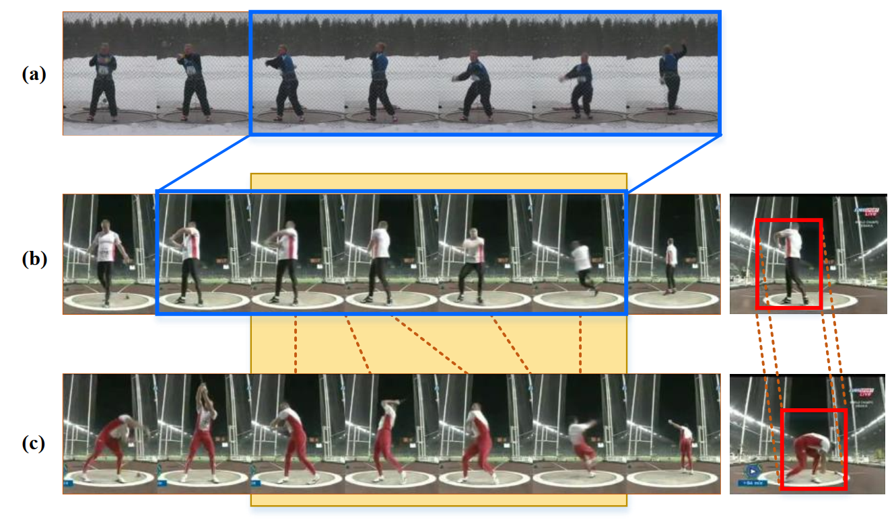
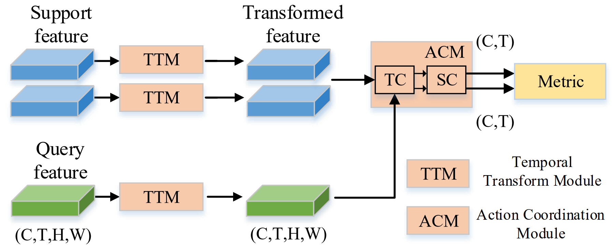

# TA2N: Two-Stage Action Alignment Network for Few-Shot Action Recognition

## Updata
The completed **training** code is released.


## Motivaion
<div align="center">
<br/>
</div>
Example of action misalignment. (a)&(b): action duration misalignment. The action duration is highlighted with blue rectangles. (b)&(c): action evolution misalignment in temporal (left) and spatial (right) aspects. The red dashed connected lines indicate pairs of temporal or spatial positions are consistent in action content. The action category of these presented videos is ‘Hammer throw’.


## Contribution
- We delve specifically into the misalignment problem in few-shot action recognition, revealing and quantifying two critical aspects of this issue: the action duration and evolution misalignment.
- We propose a novel two-stage action alignment network (TA2N), which performs a jointly spatial-temporal action alignment over videos, to address these two aspects of misalignment sequentially.
- Extensive experiments show that our proposed method could relieve the misalignment and achieve state-of-theart results in few-shot video action recognition.

## Overview

<div align="center">
<br/>
</div>


## Overall training & Eval
1. Set the path of extracted video frames in args.scratch
2. Set the split path in run_ta2n.py Line.148~Line.167 (all splits are provided in splits/ folder, you can set as this folder)
3. Then, run on 2 GPU:
```
bash experiments/train_ucf_ta2n.sh
```

## Individual TA2N module Usage
First, obtain video feature embeddings through the Resnet-50 and transpose into (N, T, C, H, W) shape.

```python
support = torch.rand(5, 2048, 8, 7, 7).cuda()
query = torch.rand(5, 2048, 8, 7, 7).cuda()
```
Then, feed the support and query feature into TA2N:
```python
ta2n = TA2N(T=8,shot=1, dim=(2048,2048),first_stage=TTM, second_stage=ACM).cuda()
pairs, offsets = ta2n(support, query)
```

You can split aligned query and support features from paired feature:

```
aligned_support, aligned_query = pairs[:,:,:2048,...],pairs[:,:,2048:,...]
```

Distance can be then measured by a defined metric:

```
dist = timewise_cos(aligned_support, aligned_query)
```

## Bibtex
If you find our work helpful for your research, please consider citing the following BibTeX entry.

```bibtex
@inproceedings{li2022ta2n,
  title={TA2N: Two-Stage Action Alignment Network for Few-Shot Action Recognition},
  author={Li, Shuyuan and Liu, Huabin and Qian, Rui and Li, Yuxi and See, John and Fei, Mengjuan and Yu, Xiaoyuan and Lin, Weiyao},
  booktitle={Proceedings of the AAAI Conference on Artificial Intelligence},
  volume={36},
  number={2},
  pages={1404--1411},
  year={2022}
}
```

## Contact

Feel free to contact huabinliu@sjtu.edu.cn if you have any questions.
